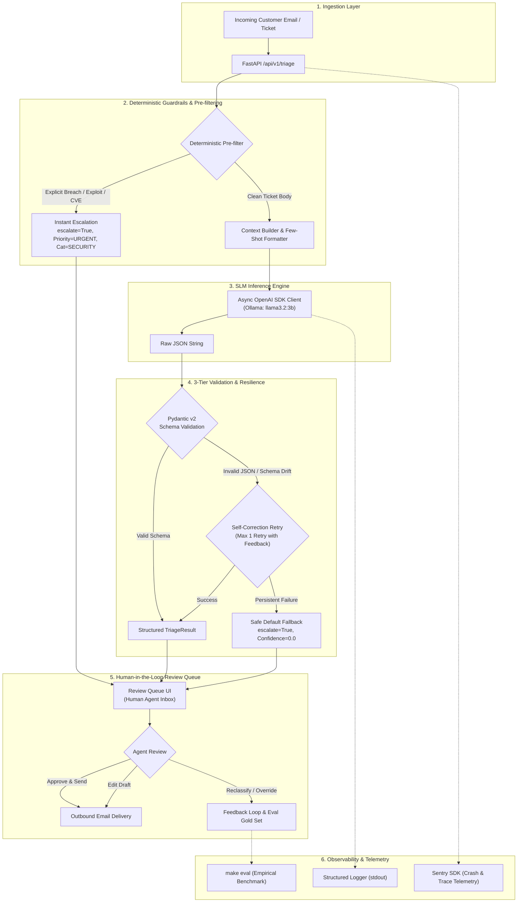
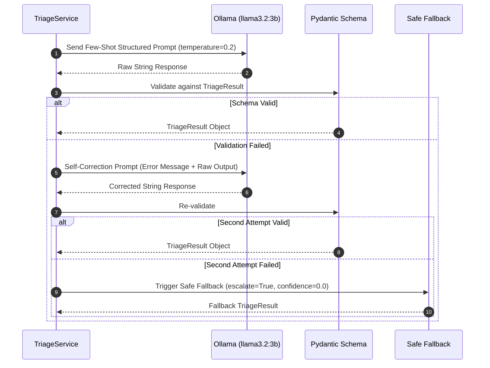
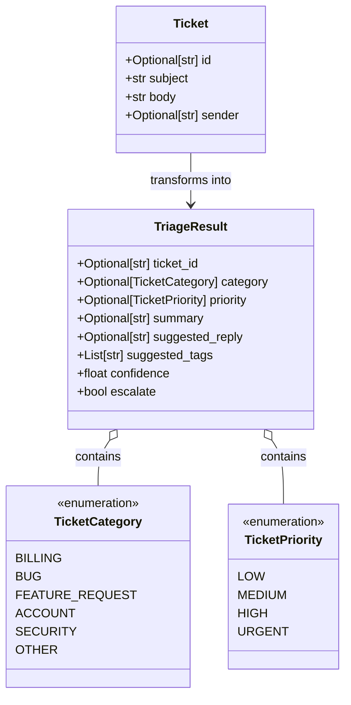

# 🏛️ System Architecture Blueprint: Support Inbox Assistant

## 1. Executive Summary & Vision

The **Support Inbox Assistant** is an enterprise-grade, human-in-the-loop automated triage system engineered to optimize customer support workflows. Instead of blindly automating outbound customer responses—which introduces catastrophic hallucination and security risks—the system functions as an **Agentic Copilot for Support Teams**:

1. **Intakes** incoming tickets and emails asynchronously.
2. **Pre-filters & Enriches** deterministic patterns (e.g. VIP status, active incidents, explicit security triggers).
3. **Classifies & Scores** intent into strict categories and priority tiers using a lightweight local Small Language Model (SLM: `llama3.2:3b`).
4. **Calibrates Confidence**: Calculates a normalized confidence score $[0.0, 1.0]$ and sets defensive escalation flags (`escalate: true`).
5. **Generates Draft Replies & Summaries**: Provides a 1-line contextual summary and an editable suggested response for human verification.
6. **Empowers Human Review**: Serves a specialized review queue where human support agents approve, refine, or override classifications with single-click actions.

---

## 2. End-to-End System Architecture

---

## 3. Core Architectural Decisions & Trade-Offs

### Decision 1: Lightweight Client (`openai` SDK) over LangChain / LlamaIndex
* **Rationale:** LangChain introduces unnecessary layers of abstraction, bloated dependencies, and heavy memory overhead. For deterministic structured triage with local models, `openai>=1.0.0` (with `base_url="http://localhost:11434/v1"`) combined with `pydantic>=2.0` offers:
  - Sub-millisecond import and boot times.
  - Transparent error recovery loops without black-box framework internals.
  - Zero cognitive bloat for debugging and tracing.
* **Trade-off:** We hand-craft prompt templates and retry logic, which guarantees 100% control over edge-case behavior.

### Decision 2: 3-Tier LLM Resilience Pattern for SLMs (`llama3.2:3b`)
Local Small Language Models (SLMs) have significantly smaller parameter counts and can produce syntax anomalies or hallucinated categories under stress. We protect system stability using a strict 3-tier defense:

### Decision 3: Clean Layered Architecture
The repository strictly isolates concerns into clean layers:
- `src/core/`: Configuration via environment variables, structured console logging, and Sentry error telemetry.
- `src/schemas/`: Immutable, strongly-typed Pydantic domain models.
- `src/services/`: Pure business logic (LLM API wrapper, triage classification, fallback handlers).
- `src/api/`: FastAPI routers and HTTP transport concerns.
- `eval/`: Empirical evaluation harness, ground truth testing, and benchmark metrics output.
- `frontend/`: Human review workspace.

---

## 4. Domain Data Schema

---

## 5. Security & Safety Protocols

1. **No Automatic Unsupervised Outbound Communication:** The system never transmits an AI-generated email to an external customer without human agent sign-off.
2. **Defensive Prompt Injection Handling:** Incoming ticket bodies are quarantined as untrusted data inputs and parsed within explicit delimiter tags (`<ticket_body>...</ticket_body>`).
3. **Automated Security Incident Escalation:** Tickets matching security markers (`unauthorized access`, `vulnerability`, `credential leak`) bypass standard queues and automatically set `priority = URGENT` and `escalate = True`.
