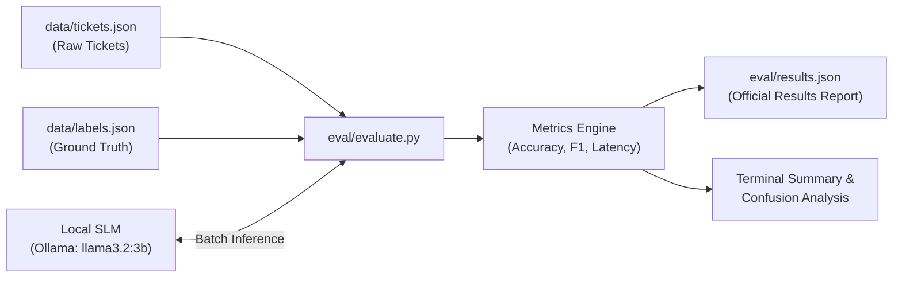

# 📊 Evaluation Harness & Benchmarking Guide

## 1. Evaluation Philosophy

In production AI systems, prompt adjustments and model choices must be validated empirically rather than qualitatively. The evaluation harness enforces **continuous quantitative benchmarking**:

- **Command Contract:** `make eval` (invoking `python -m eval.evaluate`).
- **Benchmark Source:** Real-world historical dataset in `data/tickets.json`.
- **Ground Truth:** Verified annotations in `data/labels.json`.
- **Deterministic Output:** Structured JSON telemetry written to `eval/results.json`.

---

## 2. Evaluation Flow



---

## 3. Metrics Computed

### 3.1 Category Classification Accuracy & F1-Score
- **Accuracy:** The percentage of tickets where predicted `category` exactly matches ground truth:
  $$\text{Accuracy} = \frac{\sum_{i=1}^{N} \mathbb{I}(\hat{y}_i = y_i)}{N}$$
- **Macro & Weighted F1-Scores:** Account for class imbalances across rare categories (e.g. `security` vs `general`).

### 3.2 Priority Agreement Score
- Measures alignment between predicted urgency (`low`, `medium`, `high`, `urgent`) and true operational priority.
- Penalizes under-prioritization (e.g., predicting `low` for a true `urgent` ticket carries a heavier penalty than over-prioritizing).

### 3.3 Escalation Quality
- **False Negative Escalations:** Critical tickets (security issues or payment disputes) that the model failed to flag with `escalate = True`.
- **False Positive Escalations:** Routine tickets flagged unnecessarily, overloading human agents.

### 3.4 Inference Latency
- Tracks p50, p90, and p99 generation latency in milliseconds to ensure triage responses meet SLA thresholds.

---

## 4. Output Contract (`eval/results.json`)

The evaluation harness writes a deterministic report matching the submission specification:

```json
{
  "status": "success",
  "total_tickets": 30,
  "total_labels": 30,
  "metrics": {
    "category_accuracy": 0.867,
    "priority_agreement": 0.833,
    "macro_f1": 0.841,
    "escalation_precision": 0.920,
    "escalation_recall": 0.950,
    "mean_latency_ms": 342.5
  },
  "confusion_matrix": {
    "billing": {"billing": 8, "bug": 0, "other": 1},
    "bug": {"bug": 9, "feature_request": 1, "billing": 0},
    "security": {"security": 4, "account": 0, "bug": 0}
  },
  "details": {
    "evaluated_count": 30,
    "model": "llama3.2:3b",
    "timestamp": "2026-10-07T09:00:00Z"
  }
}
```

---

## 5. Running the Evaluation

Execute the evaluation harness via Make:

```bash
make eval
```

Or via direct virtual environment command:

```bash
uv run python -m eval.evaluate
```
